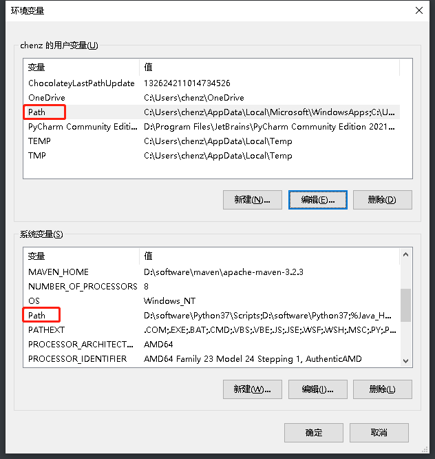
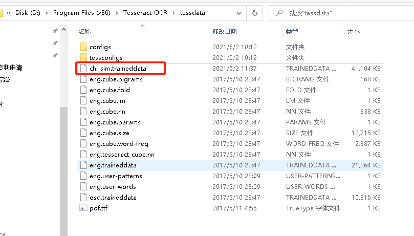

#### 1、需要安装  tesseract-ocr-setup-3.05.00dev.exe

#### 2、安装完成以后配置环境变量

把刚才的安装路径“C:\Program Files (x86)\Tesseract-OCR”添加到Path和path中



```
查看是否配置成功
tesseract -v
```


#### 3、安装中文插件包

###### 下载地址 https://github.com/tesseract-ocr/tessdoc/blob/master/tess3/Data-Files.md  根据tesseract安装的版本选择是版本3还是4

```
这个路径下把下载的中文包复制进来 chi_sim.traineddata
D:\Program Files (x86)\Tesseract-OCR\tessdata
```



